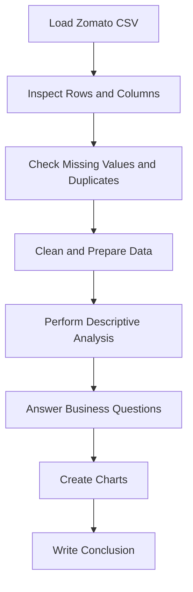

<div align="center">

# Zomato Restaurant Data Analysis

### Descriptive analysis of customer preferences and restaurant business trends

[](https://www.python.org/)
[](https://pandas.pydata.org/)
[](https://matplotlib.org/)
[](https://www.kaggle.com/)
[](https://jupyter.org/)

</div>

---

## Overview

This project performs descriptive analysis on a real-world Zomato restaurant dataset. It uses Python, Pandas and Matplotlib to clean the data, answer business questions and create charts.

The analysis focuses on restaurant locations, cuisines, customer ratings, customer votes, price ranges and online-delivery availability.

## Objective

The objective is to identify customer preferences and business trends that can help restaurant owners understand:

- Where restaurants are highly concentrated
- Which cuisines are widely available
- How customers rate restaurants
- Which restaurants receive high customer engagement
- How common online delivery is
- Which price range is used by most restaurants

## Dataset

The project uses the [Zomato Dataset by Utkarsh Mathur](https://www.kaggle.com/datasets/mathurutkarsh/zomato-dataset) from Kaggle.

The dataset contains restaurant information from different cities and countries.

### Important columns

| Column | Description |
|---|---|
| `Restaurant Name` | Name of the restaurant |
| `City` | City where the restaurant is located |
| `Cuisines` | Cuisines served by the restaurant |
| `Average Cost for two` | Estimated meal cost for two people |
| `Has Table booking` | Whether table booking is available |
| `Has Online delivery` | Whether online delivery is available |
| `Price range` | Restaurant price category from 1 to 4 |
| `Aggregate rating` | Average customer rating out of 5 |
| `Rating text` | Text description of the rating |
| `Votes` | Number of customer rating votes |

> The CSV file is loaded using `latin-1` encoding because it contains characters that cannot be decoded correctly using the default UTF-8 encoding.

## Business Questions

The project answers the following questions:

1. Which city has the highest number of restaurants?
2. Which cuisine is the most common?
3. What is the average customer rating?
4. Which city has the highest average rating?
5. What percentage of restaurants provide online delivery?
6. Which restaurants received the highest customer votes?
7. Which price range is the most common?

## Data Cleaning

The following cleaning operations are performed before analysis:

- Removed exact duplicate rows
- Removed duplicate restaurant IDs
- Removed rows missing important analysis values
- Removed unnecessary spaces from text columns
- Renamed long column names for easier analysis
- Excluded zero ratings when calculating customer-rating averages because zero represents an unrated restaurant

## Analysis Workflow



## Visualizations

The notebook creates the following charts:

- Top 10 cities by number of restaurants
- Distribution of customer ratings
- Top 10 most common cuisines
- Online-delivery availability
- Restaurant price-range distribution

## Key Outputs

After execution, the notebook displays:

- The city with the highest restaurant concentration
- The most common cuisine
- The average rating of rated restaurants
- The highest-rated city with a minimum of 20 rated restaurants
- The percentage of restaurants offering online delivery
- The ten restaurants with the highest customer votes
- The most common restaurant price category

The results are calculated directly from the cleaned dataset and are not hardcoded.

## Technologies Used

| Technology | Purpose |
|---|---|
| Python | Programming language |
| Pandas | Data loading, cleaning and analysis |
| NumPy | Numerical and missing-value operations |
| Matplotlib | Data visualization |
| Jupyter Notebook | Interactive code execution |
| Kaggle | Dataset hosting and notebook environment |

## Run the Project on Kaggle

1. Open [Kaggle](https://www.kaggle.com/).
2. Create a new notebook.
3. Select **Add Input**.
4. Search for `Zomato Dataset` by `mathurutkarsh`.
5. Add the dataset to the notebook.
6. Upload or copy the project notebook.
7. Select **Run All**.
8. Review the generated tables, charts and conclusion.
9. Select **Save Version** to save the completed notebook.

The dataset is loaded using:

```python
import pandas as pd

file_path = "/kaggle/input/datasets/mathurutkarsh/zomato-dataset/zomato.csv"

df = pd.read_csv(
    file_path,
    encoding="latin-1",
    low_memory=False
)
```

## Run Locally

### Requirements

- Python 3.9 or newer
- Jupyter Notebook or JupyterLab
- Pandas
- NumPy
- Matplotlib

### Installation

```bash
pip install pandas numpy matplotlib notebook
```

Download `zomato.csv` from Kaggle, place it inside a `data` folder and update the notebook path:

```python
file_path = "data/zomato.csv"
```

Start Jupyter Notebook:

```bash
jupyter notebook
```

## Suggested Repository Structure

```text
zomato-restaurant-analysis/
├── Zomato_Restaurant_Analysis.ipynb
├── README.md
└── data/
    └── README.md
```

The original dataset should not be uploaded to GitHub unless its Kaggle licence permits redistribution. Add a small `data/README.md` containing the Kaggle dataset link instead.

## Learning Outcomes

This project demonstrates how to:

- Load CSV data with a specific character encoding
- Explore rows, columns and data types
- Find missing and duplicate values
- Clean a real-world dataset
- Use `value_counts()`, `groupby()`, `mean()` and `sort_values()`
- Split and analyse comma-separated cuisine values
- Calculate percentages
- Create bar charts, histograms and pie charts
- Convert analysis results into business conclusions

## Limitations

- The data represents restaurant listings available when the dataset was collected.
- Restaurant information, ratings and delivery availability may have changed.
- A high number of restaurant listings does not automatically prove high customer demand.
- Customer votes indicate engagement, but they do not represent every restaurant customer.
- The analysis describes existing data and does not predict future business performance.

## Author

**Santhosh**  
B.Sc. Artificial Intelligence and Data Science  
AMET University

[](https://github.com/santhosh-v07)

---

<div align="center">

Built as an educational descriptive-data-analysis project using Python.

</div>
